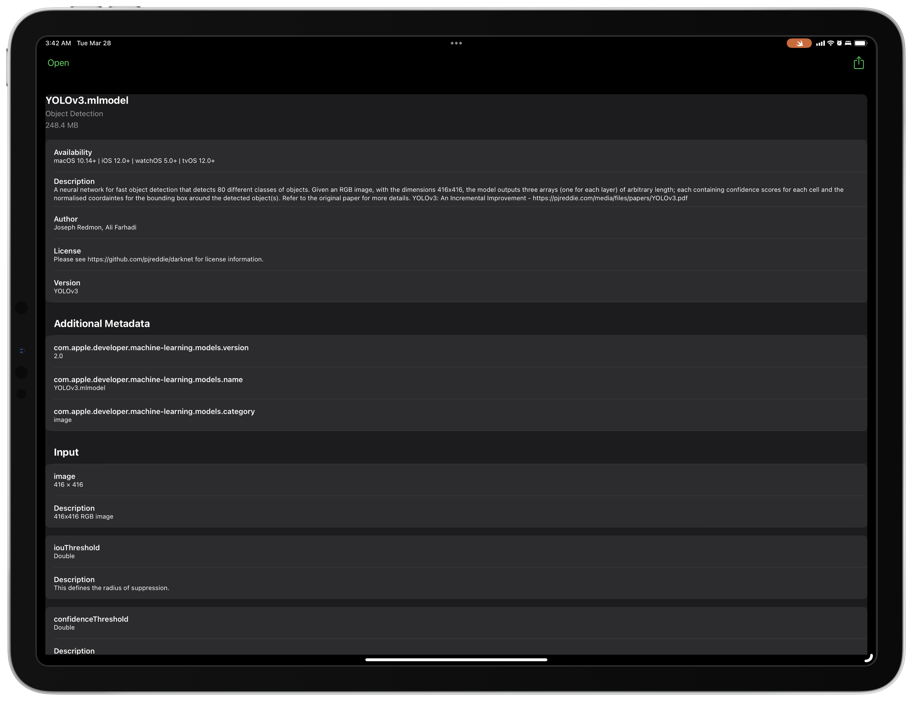

# Core ML Compiler

Core ML Compiler is an iPadOS/iOS app to convert a .mlmodel file into a .mlmodelc file.

## Target platforms

- iPadOS 16.1 or later
- iOS 16.0 or later

## Build requirements

- Swift Playgrounds 4.2 or later (iPadOS 16.0 or later)
- Xcode 14.0 or later (macOS 12.5 or later)

## Get Started

1. Clone this repository
    - To clone, I recommend using [Working Copy](https://workingcopyapp.com) or [a-Shell](https://holzschu.github.io/a-Shell_iOS/) (`lg2` command).
2. Open CoreMLCompiler.swiftpm
3. Run
